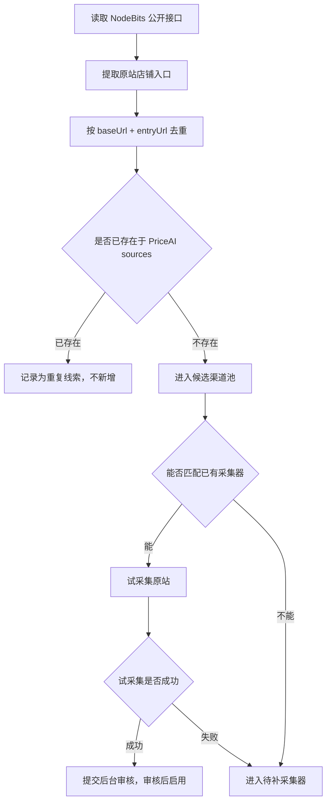

# NodeBits 竞品调研与 PriceAI 借鉴方案

> 文档类型：竞品调研 / 产品方案草案  
> 调研日期：2026-06-03  
> 竞品链接：https://www.nodebits.xyz  
> 当前状态：仅作为分析与方案，不直接触发代码开发

## 1. 调研结论

NodeBits 和 PriceAI 的目标用户高度相近，都是面向想低成本获取 AI 会员、账号、邮箱、虚拟卡、接码等资源的人。区别在于：

- PriceAI 当前更像一个“原站采集 + 标准商品聚合 + 有货最低价”的比价工具。
- NodeBits 更像一个“AI 低价资源导航 + 店铺目录 + 社区提交 + 风险曝光”的资源平台。

因此，NodeBits 最值得 PriceAI 借鉴的不是具体 UI，也不是直接复制它的报价数据，而是它的信息架构：

- 把“店铺/渠道”作为一等入口。
- 把“会员/商品”作为另一条浏览路径。
- 增加“广场/社区”类信息承载用户提交和讨论。
- 增加“骗子曝光/风险提示”模块，解决低价渠道市场里的信任问题。

对 PriceAI 来说，合理策略是：借鉴它的产品结构，把公开出现的原站店铺链接作为“候选渠道线索”，再由 PriceAI 自己的采集器去原站采真实价格、库存和商品链接。

## 2. 已确认观察

### 2.1 页面结构

NodeBits 公开导航包括：

- 首页
- 店铺
- 会员
- 广场
- 骗子曝光

同时，它在顶部放了 Telegram 和 QQ 社群入口，说明它不是单纯工具站，而是把社区运营作为产品的一部分。

### 2.2 技术形态

从公开页面可见：

- 前端是 Next.js。
- 页面首屏 HTML 大量依赖客户端加载。
- 已接入 Umami，脚本地址为 `https://umami.nodebits.xyz/script.js`。
- `robots.txt` 允许普通搜索抓取，但明确限制 AI 训练类用途。

### 2.3 公开接口线索

从页面静态资源和公开请求中观察到以下接口：

```text
https://www.nodebits.xyz/api/shops
https://www.nodebits.xyz/api/products
https://www.nodebits.xyz/api/tags
```

这些接口返回了店铺、商品、标签等公开数据。需要注意：这些数据属于 NodeBits 的聚合结果，不能直接当成 PriceAI 的报价数据源。

### 2.4 标签体系

NodeBits 的标签覆盖范围比 PriceAI 当前前台分类更宽，公开标签包括：

```text
Apple Id, ChatGPT, Claude, Cursor, Discord, Gemini, GitHub, Gmail,
Google, Google Voice, Grok, Hotmail, Outlook, Perplexity, Telegram,
Tiktok, Windsurf, 推特, 教育邮箱, 短信服务, 私人住宅IP, 虚拟卡
```

这说明用户需求不只停留在 ChatGPT、Claude、Gemini、Grok 这几个 AI 会员平台，还会自然扩展到：

- 邮箱：Gmail、Outlook、Hotmail、教育邮箱。
- 工具账号：Cursor、Windsurf、GitHub、Perplexity。
- 社媒账号：Telegram、推特、Tiktok、Discord。
- 基础设施：短信服务、私人住宅 IP、虚拟卡。

PriceAI 当前已经把虚拟卡放入“其他”，并把“其他”拆成接码、虚拟卡、其他工具账号、其他。NodeBits 的标签体系可以作为后续细化“其他”类目的参考。

## 3. 可借鉴的产品能力

### 3.1 店铺页

PriceAI 当前主要是“标准商品 -> 报价”。这适合买家快速找最低价，但缺少一个“渠道视角”。

建议新增或强化店铺页：

- 展示店铺名称、入口链接、主要标签。
- 展示该店铺当前有货商品数、缺货商品数。
- 展示最近采集成功时间、连续失败次数。
- 展示该店铺下的商品分布，例如 ChatGPT、Gemini、邮箱、接码、虚拟卡。
- 支持从店铺页进入该店铺的所有报价。

这样用户可以回答另一个问题：这个店铺到底卖什么，最近是否还活跃？

### 3.2 商品页和店铺页双路径

NodeBits 有“店铺”和“会员”两个入口，这一点值得保留。

PriceAI 建议形成双路径：

- 按商品找：适合“我想买 ChatGPT Plus，哪里最低价”。
- 按店铺看：适合“我想看看某个渠道是否可靠、卖什么、最近有没有更新”。

这两个路径最终都应该回到同一份原站采集报价，不维护两套数据。

### 3.3 风险曝光 / 应急处置

NodeBits 有“骗子曝光”，说明低价渠道市场里，用户不只关心价格，也关心风险。

PriceAI 已经有后台下架、停用渠道、隐藏报价等能力，下一步可以把它产品化：

- 前台增加“反馈问题”入口，支持用户反馈某个渠道或商品异常。
- 后台对渠道和报价增加快速处置：临时隐藏、停采、加入观察名单。
- 店铺页展示轻量风险状态，例如“近期有用户反馈，购买前请自行核验”。

注意：第一版不建议在前台做复杂可信度评分，容易引发争议。更合适的是做事实型提示：用户反馈数、最近处理时间、是否被临时隐藏。

### 3.4 社区提交渠道

NodeBits 把社群入口放得很明显，说明渠道发现本身是一个社区协作过程。

PriceAI 现有“提交渠道”功能可以进一步强调：

- 文案从“提交渠道”升级为“提交你发现的低价渠道”。
- 提交后告诉用户：系统会先解析入口，能自动采集才会进入比价。
- 后台把提交链接分为：可解析、重复渠道、待补采集器、拒绝。

这和 PriceAI 之前确认的闭环一致：用户提交后，不走长期人工补录，而是推动采集器能力扩展。

### 3.5 标签体系

NodeBits 的标签体系可以补足 PriceAI 的“其他”分类。

建议 PriceAI 后续平台/类目保持克制：

- 一级平台仍保持：ChatGPT、Claude、Gemini、Grok、Google、API/CDK、邮箱、其他。
- 其他内部标签可以细化：接码、虚拟卡、工具账号、社媒账号、住宅 IP、教育邮箱。
- 前台先不把所有标签都做成顶部入口，避免主界面复杂。

## 4. 渠道线索纳入原则

### 4.1 不直接导入 NodeBits 报价

不建议直接导入 NodeBits 的报价、排序、描述、热度、收藏数、浏览量。

原因：

- 这些是竞品自己的聚合和运营数据。
- 报价可能已经经过它的清洗、分类和审核。
- 直接复用会让 PriceAI 的数据来源变得不清楚。
- PriceAI 的核心价值应该是原站采集，而不是二次搬运。

### 4.2 可以把原站入口作为候选线索

如果 NodeBits 公开数据中出现了原始店铺入口，例如：

```text
https://pay.ldxp.cn/shop/xxxx
https://某个卡网域名/
```

这些可以作为 PriceAI 的候选渠道线索，但必须走自己的审核和采集流程：

1. 解析出原站店铺入口。
2. 判断是否已存在于 `sources`。
3. 判断是否能匹配已有采集器，例如 `shopApi`、`kami`、`beibeiHtml`。
4. 试采集原站。
5. 采集成功后再纳入 PriceAI。
6. 采集失败则进入“待补采集器”，不做人工长期维护。

### 4.3 不纳入单商品链接作为渠道

NodeBits 的商品数据里可能有商品链接，例如：

```text
https://pay.ldxp.cn/item/xxxxxx
```

这类链接不应该直接成为 PriceAI 渠道。它只能作为反查线索：

- 如果能从商品数据或原站反查到店铺入口，则纳入店铺入口。
- 如果只能拿到单商品链接，先进入“待反查店铺入口”。
- 后台允许运营手动补充店铺入口字段。

这和 PriceAI 近期讨论的“用户误提交商品链接，需要反解析店铺入口”问题一致。

## 5. 渠道候选处理流程

建议把 NodeBits 候选渠道处理成一个独立的导入流程，而不是混进正常采集脚本。



候选渠道池可以先不做前台展示，只作为后台工具。

## 6. 候选渠道优先级

如果后续从 NodeBits 提取渠道线索，建议按优先级处理：

### P0：已经支持采集器的原站

例如 `pay.ldxp.cn/shop/...` 这类 PriceAI 已经支持 `shopApi` 的来源。

处理方式：

- 去重。
- 试采集。
- 成功后进入审核。
- 审核通过后加入定时采集。

### P1：高相关但需要新增采集器的卡网

例如独立卡网域名、常见发卡系统、Kami 风格接口等。

处理方式：

- 先识别技术栈。
- 如果 2 小时内可补采集器，则加入“待补采集器”。
- 如果明显有登录、验证码、WAF，则暂缓。

### P2：只有商品链接、没有店铺入口

处理方式：

- 尝试反查店铺入口。
- 反查失败时，不进入采集器，只进入待办。

### P3：社群、个人联系方式、纯描述型店铺

例如只给 Telegram、QQ、个人联系方式，没有公开商品页。

处理方式：

- 不进入 PriceAI 自动采集。
- 可作为社区线索，但不参与比价。

## 7. 对 PriceAI 当前产品的改造建议

### 7.1 新增“店铺/渠道”主入口

建议 PriceAI 前台新增一个低调但清晰的入口：

- 商品
- 店铺
- 反馈

“商品”仍是默认首页，不改当前核心比价体验。

店铺页第一版字段：

- 店铺名称
- 主域名
- 入口链接
- 平台标签
- 有货报价数
- 缺货报价数
- 最近成功采集时间
- 是否启用

### 7.2 后台增加候选渠道池

后台来源页可以增加一个“候选渠道”视图：

- 来源：用户提交 / NodeBits 线索 / 手动添加。
- 原始链接。
- 反查到的店铺入口。
- 推荐采集器。
- 试采集结果。
- 操作：试采集、通过、加入待补采集器、拒绝、复制上下文。

这可以和现有提交渠道审核流程合并，不需要另做一套后台。

### 7.3 强化渠道去重

NodeBits 暴露出的数据里能看到同一个店铺可能以不同名称出现。PriceAI 后续纳入候选时必须先去重。

去重建议：

- `baseUrl + normalizedEntryPath` 为主键。
- `pay.ldxp.cn/shop/xxx` 以 shop slug 为核心。
- 商品链接 `pay.ldxp.cn/item/xxx` 不参与渠道去重，需要先反查店铺入口。
- 店铺名称只作为辅助，不作为唯一标识。

### 7.4 引入“竞品线索导入”而不是“竞品同步”

后续可以做一个脚本，但名称和定位应该明确：

```text
import:competitor-leads
```

不要叫：

```text
sync:nodebits
```

原因是它不是长期同步竞品数据，而是把公开出现的原站入口变成候选线索。

## 8. 数据边界

PriceAI 可以使用：

- 公开页面中出现的原站店铺入口作为线索。
- 原站公开页面/API 中采集到的价格、库存、商品标题。
- 用户主动提交给 PriceAI 的渠道链接。

PriceAI 不应该使用：

- NodeBits 的报价作为 PriceAI 报价。
- NodeBits 的店铺排序、收藏数、浏览量作为 PriceAI 排序依据。
- NodeBits 的店铺描述作为 PriceAI 店铺介绍。
- NodeBits 的风险曝光内容作为 PriceAI 风险结论。

一句话原则：

> 竞品只提供线索，事实必须来自原站。

## 9. 可执行落地计划

### 第一阶段：文档确认

- 确认是否借鉴“店铺页 / 骗子曝光 / 广场”这三个方向。
- 确认是否允许把 NodeBits 公开原站入口作为候选渠道线索。
- 确认是否把候选渠道统一纳入现有提交审核流程。

### 第二阶段：只做线索分析脚本

目标不是导入报价，而是输出候选渠道清单：

- 原站入口链接。
- 来源页面或接口。
- 推荐采集器。
- 是否已存在。
- 是否能试采集。
- 失败原因。

输出为后台可审核的候选记录，或先输出 CSV / JSON 给人工确认。

### 第三阶段：后台闭环

把候选渠道纳入已有审核流程：

- 批量试采集。
- 一键拒绝。
- 一键加入待补采集器。
- 一键复制上下文。
- 反查商品链接对应店铺入口。

### 第四阶段：前台能力增强

- 新增店铺页。
- 商品详情页增加“查看该店铺全部报价”。
- 店铺页增加“反馈该店铺问题”。
- 风险信息先以用户反馈和后台处置状态展示，不做复杂评分。

## 10. 当前建议

短期建议优先做两件事：

1. 把 NodeBits 当作“渠道线索池”，不要当作“报价数据源”。
2. PriceAI 先补“店铺页”和“候选渠道审核闭环”，再考虑社区广场和骗子曝光。

这样既能借鉴 NodeBits 的优点，又能保留 PriceAI 自己的核心差异：原站采集、有货最低价、标准商品聚合、可核验来源。

